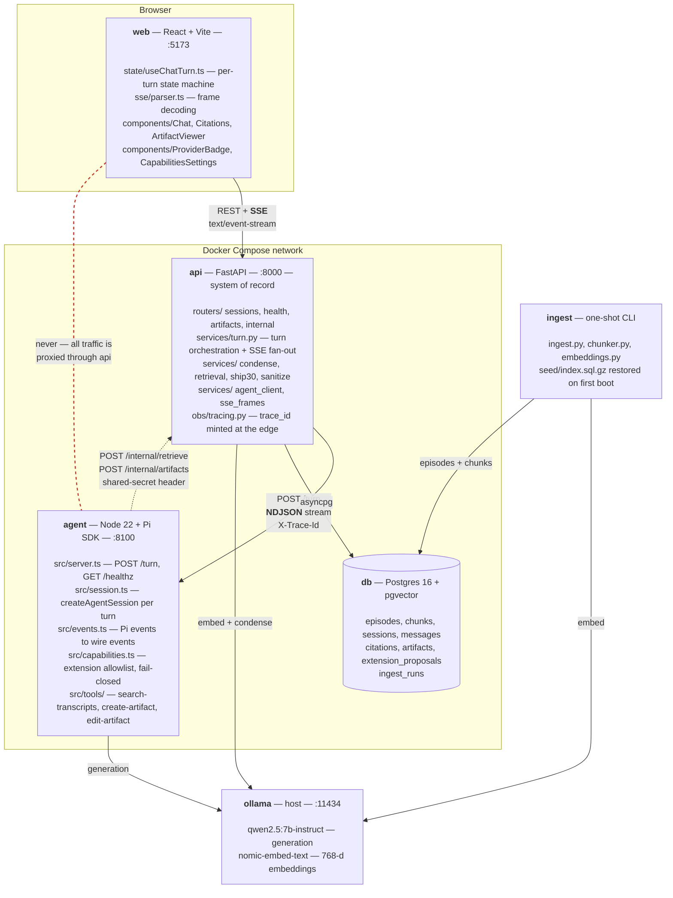
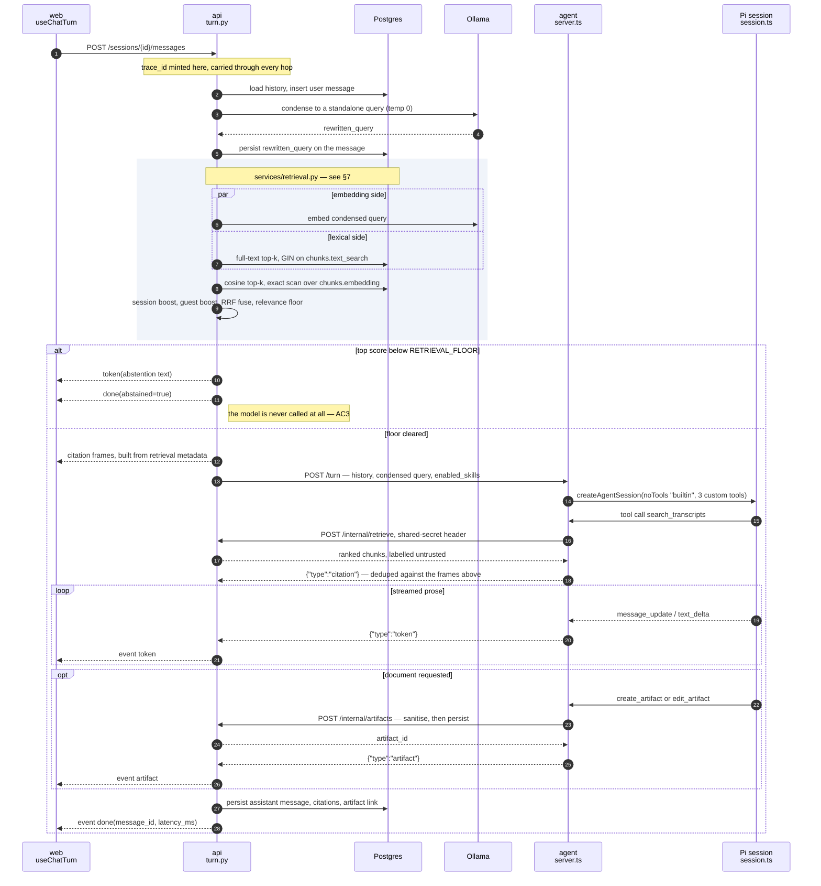
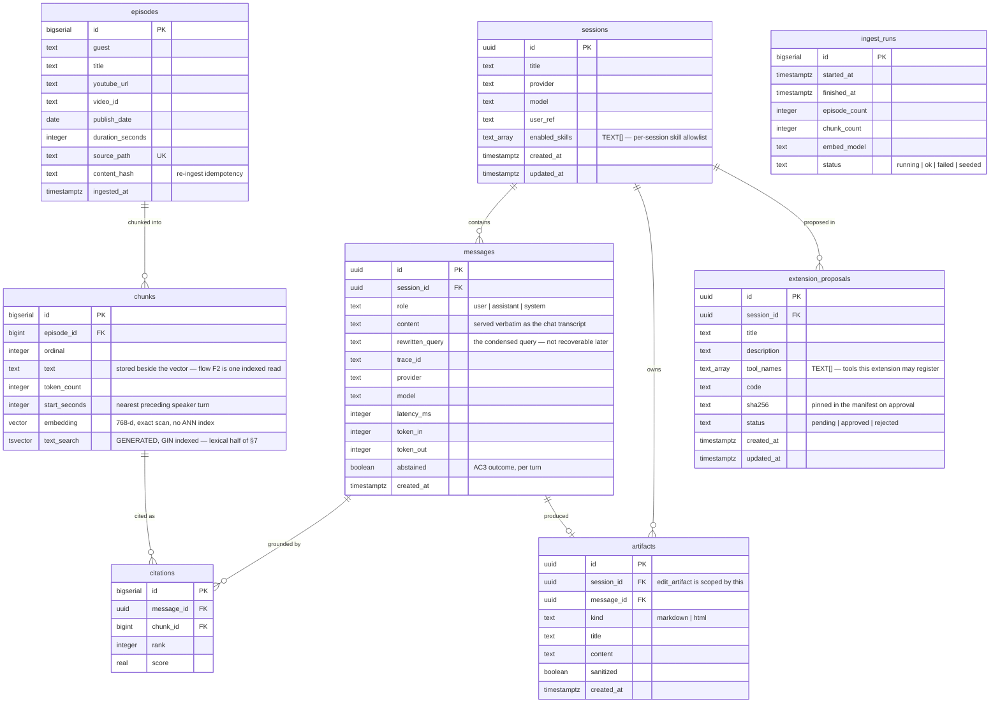
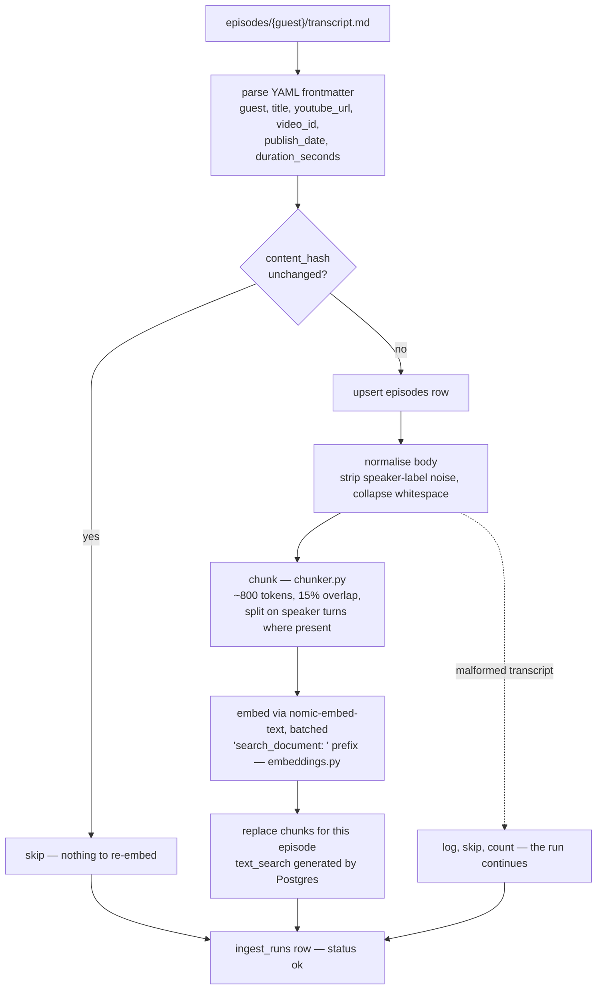
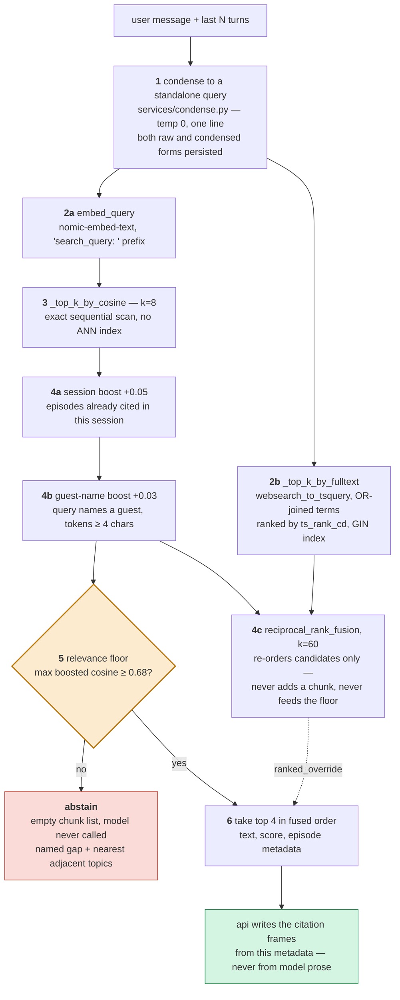
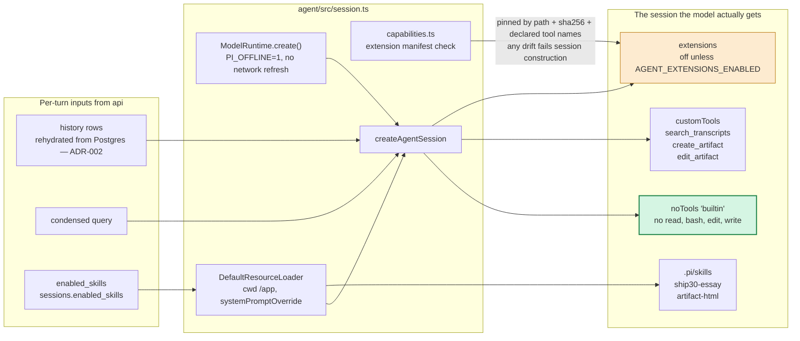
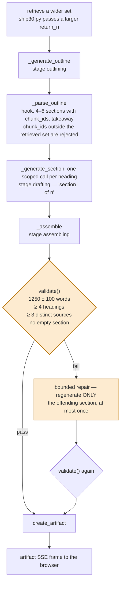
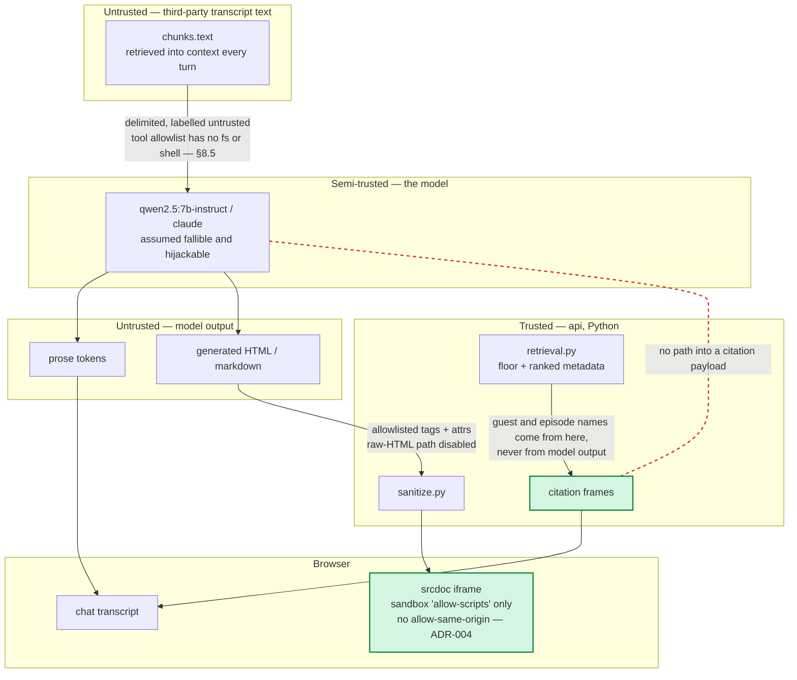
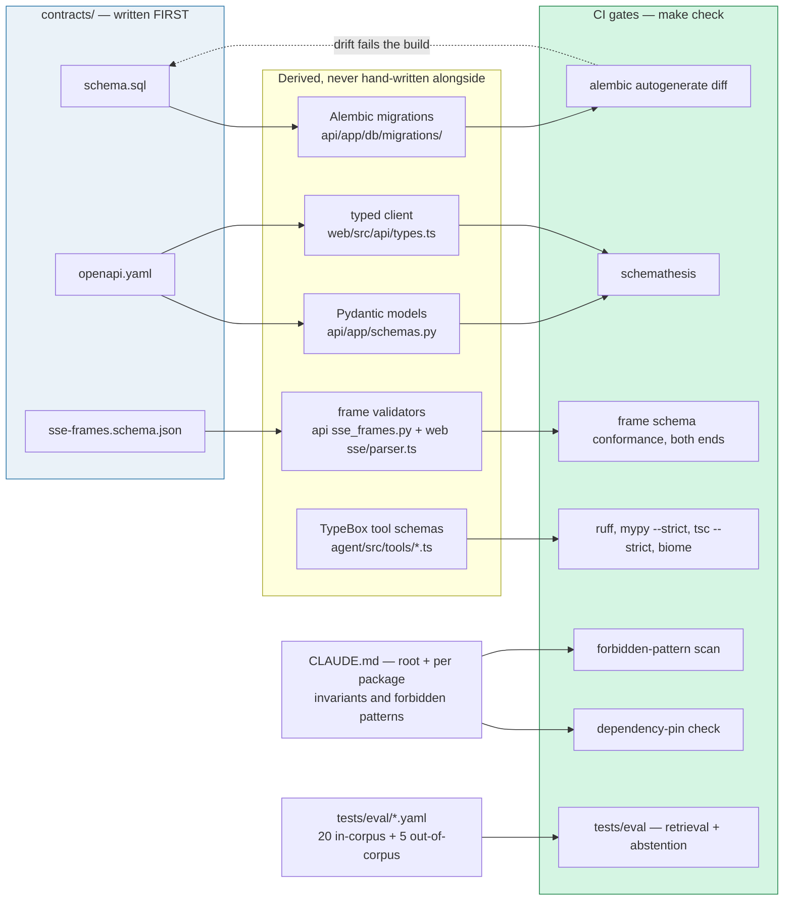

# architecture.md — The Lenny Growth Assistant

| | |
|---|---|
| **Status** | Accepted for the v1 build |
| **Companion docs** | `PRD.md` (user, scope, acceptance criteria), `design.md` (UI/UX), `README.md` (run and troubleshoot) |
| **Build mode** | Implemented by Claude Code under human specification and review — see §12, which is load-bearing rather than incidental |
| **Scope of this document** | Component boundaries, deployment topology, database schema, API contracts, ingestion and retrieval flow, agent integration and routing, model toggle, security model, observability, build-time architecture, and the architecture decisions behind them |

---

## 0. Diagram index

For a reviewer coming to this codebase cold, these nine diagrams are the
fastest path in. Each is drawn from the code as it stands rather than from
the original design intent, and node labels carry the owning file so a
diagram doubles as a map into the repository.

| | Diagram | Answers |
|---|---|---|
| §2 | Component boundaries | What are the moving parts, and what talks to what over which protocol |
| §2.1 | **A turn, end to end** | The spine — start here. What actually happens between a keystroke and a cited answer |
| §4 | Entity relationships | What is persisted, and which foreign key carries which guarantee |
| §6 | Ingestion pipeline | How a transcript file becomes a searchable, citable chunk |
| §7 | Retrieval pipeline | How a question becomes four chunks — and when it becomes an abstention instead |
| §8.2 | Agent session composition | What the model is handed, and what it is structurally prevented from reaching |
| §8.4 | Ship 30 pipeline | How a 1,250-word essay gets its formatting guarantees from Python, not from the model |
| §10 | Trust boundaries | Which data is untrusted, and where each control sits |
| §12.4 | Contract derivation | Which artifacts are source of truth, which are derived, and which gate catches drift |

If you read only one, read §2.1.

---

## 1. Context and forces

The system must satisfy a set of constraints that pull against each other, and most of the design below is the resolution of those tensions rather than a free choice.

| Force | Origin | Consequence |
|---|---|---|
| Backend must be FastAPI (Python) | Client requirement | — |
| Agent layer must be Pi Coding Agent (TypeScript) | Client requirement | **A language boundary is unavoidable.** ADR-001 |
| Demo must run on a local Ollama 7B model | Client requirement | Quality guarantees must live in code, not prompts |
| Answers must be grounded and cited | Client requirement | Citations render from retrieval metadata, never from model output |
| Generated HTML must render in-app and be treated as untrusted | Client requirement | ADR-004 |
| One-command startup, no API key required | Client requirement | No network dependency at boot; index is seeded |
| One-day build window | Engagement constraint | Prefer boring, observable seams over clever ones |
| **Implementation by a coding agent, not by hand** | Engagement constraint | **Lines of code stop being a cost driver; ambiguity and unverifiable output become the cost drivers.** Contracts precede implementation, and every block ends at an executable gate. §12, ADR-006 |
| Pi SDK post-dates the coding agent's training data | Consequence of the above | The SDK reference is vendored into the repository and dependencies are pinned exactly. ADR-007 |
| Single team, tens of turns per day | Assumption A9 in the PRD | No queue, no horizontal scaling, no cache tier |

---

## 2. Component boundaries



Two hops, two different framings, and the difference is load-bearing.
`agent → api` is newline-delimited JSON — `application/x-ndjson`, one event
object per line (`agent/src/server.ts`). `api → web` is Server-Sent Events
(`api/app/services/sse_frames.py`). `api` is a translator rather than a
proxy: it is where citations are constructed, artifacts are sanitised, and
errors are shaped into the one envelope.

### Why these seams

**`api` owns all state.** The agent service is deliberately stateless between turns. Every fact the system knows lives in Postgres, which removes an entire class of consistency bugs at the cost of rehydrating conversation history per turn (ADR-002).

**Retrieval lives in `api`, not in the agent.** The agent's `search_transcripts` tool is a thin HTTP client calling back into `api`. This puts embedding, vector search, session boosting and the relevance floor in one testable Python module rather than splitting retrieval logic across two runtimes. It also means the retrieval layer can be evaluated in isolation with no agent or model in the loop — the H3–5 gate in the implementation plan depends on exactly this.

**The frontend never talks to `agent`.** All traffic is proxied through `api` so that persistence, tracing and error shaping happen in one place.

**The seams double as work-partition boundaries.** Because the system is implemented by a coding agent working in bounded sessions rather than by a person holding the whole design in their head, each service must be buildable and testable against a written contract without the others being finished. `agent` is developed against a stub `/internal/retrieve`; `web` is developed against the OpenAPI schema and a recorded SSE fixture; `ingest` is developed against the DDL alone. A design that required all four to exist before any could be tested would be a poor design for a human team and an unworkable one here.

### 2.1 A turn, end to end

The single most useful diagram for a reviewer: everything else in this
document is a detail hanging off one of these steps. Participants map to
files — `useChatTurn` is `web/src/state/useChatTurn.ts`, `turn.py` is
`api/app/services/turn.py`, `session.ts` is `agent/src/session.ts`.



**Why the ordering is what it is.** Condensation and retrieval both make a
real Ollama call, and both happen *before* the `StreamingResponse` is
constructed in `routers/sessions.py`. So "Ollama is down" surfaces as a
clean structured `503` with the error envelope, not a half-open SSE stream.
Once the response has started, headers are committed and a provider failure
can no longer become a 503 — it becomes an in-band `error` frame with
`partial: true` instead. That split is the implementation of the timeout
row in §11, and it is why the diagram shows the abstain branch resolving
before the agent is ever contacted.

---

## 3. Deployment topology

Docker Compose, four services, one network, one volume.

| Service | Image | Port | Depends on | Health check |
|---|---|---|---|---|
| `db` | `pgvector/pgvector:pg16` | 5432 (internal) | — | `pg_isready` |
| `api` | Python 3.12 slim | 8000 | `db` healthy | `GET /health` |
| `agent` | Node 22 slim | 8100 (internal) | `api` started | `GET /healthz` |
| `web` | Node build → static | 5173 | `api` started | HTTP 200 on `/` |

Ollama runs on the host and is reached via `host.docker.internal:11434`, configurable through `OLLAMA_BASE_URL`. Containerising Ollama was rejected: it would make the image multi-gigabyte and prevent evaluators from reusing models they have already pulled.

**Startup sequence.** `db` becomes healthy → `api` runs migrations then restores the seeded index → `agent` and `web` start. The seeded index is a compressed SQL dump restored on first boot only, keyed on a marker row in `ingest_runs`. This is what makes AC1 (fresh clone → first grounded answer in under 10 minutes, no API key) achievable; building the index at first run would not.

**Volumes.** `pgdata` for Postgres. `pi-sessions` mounts `/app/.pi/sessions` in the `agent` container so Pi's JSONL session files survive restarts as an audit artifact.

**Offline guarantee.** `PI_OFFLINE=1` is set in the `agent` container. Pi's `ModelRuntime.create()` restores cached model catalogues without refreshing them from the network by default, and `PI_OFFLINE` disables model network access entirely — so the agent service boots deterministically with no outbound connectivity.

**Reproducibility.** Base images are pinned by digest, Python dependencies by exact version, npm dependencies without range specifiers, and `package-lock.json` is committed. This is stricter than a hand-built project would normally warrant: a coding agent resolving `^` ranges across sessions will produce a build that worked yesterday and fails on the evaluator's machine today, and that failure is expensive to diagnose and impossible to explain away. ADR-007.

---

## 4. Database schema



`ingest_runs` stands alone by design — it has no foreign key into the corpus
because its job is to record *that* a run happened (including the `seeded`
marker row that makes first-boot restore idempotent), not to own rows.

The DDL below is the v1 statement of this schema and is kept for the design
notes attached to it. `contracts/schema.sql` is the authority and has since
gained `chunks.start_seconds`, the generated `chunks.text_search` column and
its GIN index, `sessions.enabled_skills`, and the `extension_proposals`
table — all of which the diagram above reflects.

```sql
CREATE EXTENSION IF NOT EXISTS vector;

-- ─── Corpus ────────────────────────────────────────────────────────────
CREATE TABLE episodes (
  id                BIGSERIAL PRIMARY KEY,
  guest             TEXT        NOT NULL,
  title             TEXT        NOT NULL,
  youtube_url       TEXT,
  video_id          TEXT,
  publish_date      DATE,
  duration_seconds  INTEGER,
  source_path       TEXT        NOT NULL UNIQUE,
  content_hash      TEXT        NOT NULL,
  ingested_at       TIMESTAMPTZ NOT NULL DEFAULT now()
);

CREATE TABLE chunks (
  id           BIGSERIAL PRIMARY KEY,
  episode_id   BIGINT      NOT NULL REFERENCES episodes(id) ON DELETE CASCADE,
  ordinal      INTEGER     NOT NULL,
  text         TEXT        NOT NULL,
  token_count  INTEGER     NOT NULL,
  embedding    vector(768) NOT NULL,
  UNIQUE (episode_id, ordinal)
);

-- No ANN index on chunks.embedding at this corpus size — exact sequential
-- scan instead; see the design note below and contracts/schema.sql.
CREATE INDEX chunks_episode_idx ON chunks (episode_id);

-- ─── Conversation ──────────────────────────────────────────────────────
CREATE TABLE sessions (
  id          UUID PRIMARY KEY DEFAULT gen_random_uuid(),
  title       TEXT,
  provider    TEXT        NOT NULL,
  model       TEXT        NOT NULL,
  user_ref    TEXT        NOT NULL DEFAULT 'local',
  created_at  TIMESTAMPTZ NOT NULL DEFAULT now(),
  updated_at  TIMESTAMPTZ NOT NULL DEFAULT now()
);

CREATE TABLE messages (
  id               UUID PRIMARY KEY DEFAULT gen_random_uuid(),
  session_id       UUID        NOT NULL REFERENCES sessions(id) ON DELETE CASCADE,
  role             TEXT        NOT NULL CHECK (role IN ('user','assistant','system')),
  content          TEXT        NOT NULL,
  rewritten_query  TEXT,
  trace_id         TEXT        NOT NULL,
  provider         TEXT,
  model            TEXT,
  latency_ms       INTEGER,
  token_in         INTEGER,
  token_out        INTEGER,
  abstained        BOOLEAN     NOT NULL DEFAULT false,
  created_at       TIMESTAMPTZ NOT NULL DEFAULT now()
);

CREATE INDEX messages_session_idx ON messages (session_id, created_at);

CREATE TABLE citations (
  id          BIGSERIAL PRIMARY KEY,
  message_id  UUID   NOT NULL REFERENCES messages(id) ON DELETE CASCADE,
  chunk_id    BIGINT NOT NULL REFERENCES chunks(id),
  rank        INTEGER NOT NULL,
  score       REAL    NOT NULL
);

CREATE INDEX citations_message_idx ON citations (message_id);

-- ─── Artifacts ─────────────────────────────────────────────────────────
CREATE TABLE artifacts (
  id          UUID PRIMARY KEY DEFAULT gen_random_uuid(),
  session_id  UUID NOT NULL REFERENCES sessions(id) ON DELETE CASCADE,
  message_id  UUID REFERENCES messages(id) ON DELETE SET NULL,
  kind        TEXT NOT NULL CHECK (kind IN ('markdown','html')),
  title       TEXT,
  content     TEXT NOT NULL,
  sanitized   BOOLEAN NOT NULL DEFAULT false,
  created_at  TIMESTAMPTZ NOT NULL DEFAULT now()
);

-- ─── Operations ────────────────────────────────────────────────────────
CREATE TABLE ingest_runs (
  id             BIGSERIAL PRIMARY KEY,
  started_at     TIMESTAMPTZ NOT NULL DEFAULT now(),
  finished_at    TIMESTAMPTZ,
  episode_count  INTEGER,
  chunk_count    INTEGER,
  embed_model    TEXT,
  status         TEXT NOT NULL CHECK (status IN ('running','ok','failed','seeded'))
);
```

**Design notes.**

`chunks.text` is stored beside the embedding specifically so that flow F2 — clicking a citation to see the verbatim source — costs one indexed read and no model call.

`citations` is a table rather than a JSON column on `messages` so that "which episodes does this system actually cite, and at what scores?" is a one-line query. This turns out to be the single most useful diagnostic during retrieval tuning.

`messages.rewritten_query` and `messages.abstained` exist because both are things you will need to debug and neither is recoverable after the fact.

`episodes.content_hash` makes re-ingest idempotent: unchanged transcripts are skipped, changed ones have their chunks replaced by cascade.

**Revised (see contracts/schema.sql).** The seeded corpus is ~8,531 chunks
across 302 episodes, not tens of thousands, and `ivfflat.probes` was never
set anywhere in the codebase — every query ran the default `probes = 1`,
which is a relevance bug (a true nearest neighbor outside the one probed
cluster is simply invisible), not just an under-tuned latency knob. At this
corpus size an ANN index buys nothing an exact scan doesn't already give for
free: `chunks_embedding_idx` (ivfflat) has been dropped in favor of an exact
sequential scan, which is both fully correct and still single-digit
milliseconds. See the comment above `chunks_episode_idx` in
`contracts/schema.sql` for the full reasoning and the revisit threshold
(~50k-100k chunks).

Migrations run through Alembic on `api` startup, before the service reports healthy.

---

## 5. API contracts

All responses share one error envelope:

```json
{ "error": { "code": "OLLAMA_UNREACHABLE", "message": "…",
             "trace_id": "01J…", "retryable": true } }
```

### Public endpoints

| Method | Path | Purpose | Notes |
|---|---|---|---|
| `GET` | `/health` | Liveness | Returns 200 if the process is up |
| `GET` | `/health/deps` | Dependency status | Reports `db`, `ollama`, `agent` independently, each `ok \| degraded \| down` |
| `GET` | `/config` | Active provider and model, cloud availability, corpus stats | Drives the UI provider badge |
| `POST` | `/sessions` | Create a session | `{ title? }` → `{ id, title, provider, model, created_at }` |
| `GET` | `/sessions` | List sessions | Paginated, newest first |
| `GET` | `/sessions/{id}` | Session with full message history and citations | |
| `DELETE` | `/sessions/{id}` | Delete a session and its cascade | |
| `POST` | `/sessions/{id}/messages` | **Send a turn. Returns an SSE stream.** | `{ content }` |
| `GET` | `/chunks/{id}` | Verbatim chunk text plus episode metadata | Serves flow F2 |
| `GET` | `/artifacts/{id}` | Fetch a stored artifact | |

### Internal endpoint

| Method | Path | Caller | Purpose |
|---|---|---|---|
| `POST` | `/internal/retrieve` | `agent` service only | `{ query, session_id, k? }` → ranked chunks with scores and episode metadata |

Restricted to the Compose network and guarded by a shared secret in `AGENT_INTERNAL_TOKEN`. It is not exposed through the frontend proxy.

### SSE frame protocol

`POST /sessions/{id}/messages` streams typed frames. The frontend switches on `event`:

```
event: stage      data: {"stage":"retrieving","detail":null}
event: stage      data: {"stage":"drafting","detail":"section 3 of 6"}
event: token      data: {"text":"Product-market fit is"}
event: citation   data: {"chunk_id":8412,"episode":"…","guest":"…","rank":1,"score":0.71}
event: artifact   data: {"artifact_id":"…","kind":"html","title":"…"}
event: error      data: {"code":"MODEL_TIMEOUT","message":"…","retryable":true,"partial":true}
event: done       data: {"message_id":"…","latency_ms":2140,"abstained":false}
```

The `stage` frame is what makes the Ship 30 flow (F3) legible rather than a two-minute silence. It is generated from Pi's own event stream — see §8.4.

---

## 6. Ingestion flow



The asymmetric prefixes matter and are easy to lose in a refactor: the
corpus side is embedded with `search_document: ` here, the query side with
`search_query: ` in `api/app/services/retrieval.py`. Mixing them silently
degrades every score in §7, which is why both constants carry a comment
pointing at the other.

Chunking is fixed-size rather than semantic. Podcast speech is discursive and has no section headers to exploit; semantic chunking would add a model call per document for a gain the evaluation set cannot currently detect. Overlap at 15% preserves answers that straddle a boundary, which is common when a guest builds an argument across several turns.

Run with `make ingest` (full corpus) or `make ingest EPISODES=60` (subset, selected via the repository's own `index/` topic files). The shipped image restores a pre-built seeded index; ingestion exists for refresh and for evaluators who want to rebuild from source.

**Traceability.** Every chunk resolves to an episode row carrying `source_path` and `youtube_url`, so any sentence in any answer can be walked back to a file in the source repository and a video on YouTube.

---

## 7. Retrieval flow



**2a and 2b run concurrently.** The full-text query does not depend on the
embedding, so `asyncio.gather` overlaps one round trip to Ollama with one to
Postgres — a real latency win, not a stylistic one.

**The fusion never touches the abstain decision.** RRF combines two
*rankings*, not two *scores*, so there is no principled way to compare a
fused score against a cosine threshold. `apply_floor` therefore always reads
the boosted cosine scores, and takes the fused order only as a
`ranked_override` for selecting the final four. The consequence is the one
that matters: fusion can change *which* four chunks are cited, but it can
never rescue a turn that should have abstained, and it can never introduce a
chunk that was not already a cosine nearest neighbour.

**Step 1 is the highest-value component in the system.** Flow F1 is roughly 55% of turns and its follow-ups are pronominal — *"what about B2B?"*, *"expand on that"*. Embedding those directly returns noise, and the failure is invisible on turn one and obvious on turn three. Both query forms are logged so retrieval failures are diagnosable after the fact.

**Step 5 is a Python guard, not a prompt instruction.** A 7B model handed weak context will confabulate regardless of what the system prompt asks of it. `RETRIEVAL_FLOOR` is the mechanism behind acceptance criterion AC3, and is empirically calibrated (2026-08-25) against the real corpus and all 25 `tests/eval/questions.yaml` questions, embedded with the asymmetric `search_query:`/`search_document:` prefixes and searched via exact (non-ANN) cosine similarity: the 20 in-corpus questions' top-chunk score ranged 0.7013-0.8274, the 5 out-of-corpus questions' ranged 0.5703-0.6535 — a clean gap, and `RETRIEVAL_FLOOR=0.68` sits inside it, biased slightly toward the safer (higher) side rather than the exact midpoint. The prior `0.45` was an unvalidated placeholder: every out-of-corpus question's top score comfortably clears it, so AC3 would have passed 0/5 under it, not 5/5 — see `api/app/config.py`'s `Settings.retrieval_floor` for the full derivation.

**Citations are constructed in step 6, not parsed from model output.** The model cannot invent a guest name or an episode title because it never writes them into the citation payload — it only writes prose. This is the structural reason grounding holds on a small model.

---

## 8. Agent layer — Pi integration

### 8.1 Integration shape

The `agent` service is a small Node process embedding the Pi SDK and exposing one streaming endpoint, `POST /turn`. FastAPI is the only caller. ADR-001 records why this shape was chosen over Pi's RPC mode and over reimplementing the agent loop in Python.

### 8.2 Session construction

Per turn, with history rehydrated from Postgres:

```typescript
const modelRuntime = await ModelRuntime.create();          // no network refresh
const model = modelRuntime.getModel(PROVIDER, MODEL_ID);

const loader = new DefaultResourceLoader({
  cwd: "/app",                                             // discovers .pi/skills, .pi/extensions
  systemPromptOverride: () => LENNY_SYSTEM_PROMPT,
});
await loader.reload();

const { session } = await createAgentSession({
  model,
  thinkingLevel: "off",
  modelRuntime,
  resourceLoader: loader,
  noTools: "builtin",                                      // ← containment, see 8.5
  customTools: [searchTranscripts, createArtifact, editArtifact],
  sessionManager: SessionManager.create("/app"),           // JSONL audit trail
  settingsManager: SettingsManager.inMemory({
    compaction: { enabled: true },
    retry:      { enabled: true, maxRetries: 2 },
  }),
});

session.agent.state.messages = rehydrate(historyFromPostgres);
```

`retry` gives bounded resilience against transient Ollama failures without any custom retry code. `compaction` protects long sessions from exceeding the local model's context window. Both are configuration, not code.

What that call actually assembles, and where each input is constrained:



Skills are plain prompt text with no code, so they widen what the model
*says* and never what it *can do*. Extensions are arbitrary in-process code
that can register any tool, which is why they sit behind the fail-closed
manifest rather than beside the skills.

### 8.3 Tools

Three custom tools, defined with `defineTool()` so their parameter schemas are typed and validated before the model's arguments reach our code. Each is a thin wrapper around exactly one `api` endpoint — none expose a filesystem or shell primitive (§8.5, §10).

| Tool | Parameters | Behaviour |
|---|---|---|
| `search_transcripts` | `query: string`, `k?: number` | HTTP POST to `api:8000/internal/retrieve`. Returns delimited chunk text labelled as untrusted data, plus chunk IDs which the agent echoes back for citation construction |
| `create_artifact` | `kind: 'markdown' \| 'html'`, `title: string`, `content: string` | Returns the artifact to `api`, which sanitises and persists it before it reaches the browser |
| `edit_artifact` | `artifact_id: string`, `title?: string`, `content: string` | HTTP PATCH to `api:8000/internal/artifacts/{id}`, full-replacement content. `api` verifies `artifact_id` belongs to the calling session before applying the update (routers/internal.py) — this is the only cross-turn state a tool call can target, and only by an id the model was handed on a prior turn (see the history note below), never a guessed one |

`edit_artifact` exists because `create_artifact` alone left "make it shorter" / "add a section on X" follow-ups with no tool to call — the model would paste the revised content into the chat reply instead, which is exactly the failure mode `create_artifact` exists to avoid. It needs the target's `artifact_id` on a later turn, which the SSE `artifact` frame never round-trips into the model's own context (that frame goes to the browser, not back into `session.agent.state.messages`). `api`'s `services/turn.py` closes that gap by appending a one-line `[Artifact created — id: ..., title: "..."]` note to the *agent-facing copy* of any history turn that created or last edited an artifact — never to `MessageRow.content` itself, which `GET /sessions/{id}` serves verbatim as the chat transcript. The note is metadata for the next turn's tool call, not something a user should ever see in their own conversation.

### 8.4 Skills and routing

Routing is **capability-scoped, not intent-classified.** There is no router model deciding which of several agents handles a turn. Instead, the agent has exactly three tools and a small set of skills, and the model chooses among them within a single session. This is the right shape at this scale: an intent classifier is another model call, another failure mode, and another thing to evaluate, in exchange for no capability the tool schema does not already provide.

Skills live in `.pi/skills/` and are discovered by `DefaultResourceLoader`:

| Skill | Trigger | Contract |
|---|---|---|
| `ship30-essay` | User asks for an essay, post, or long-form write-up | Emits a structured JSON outline — hook, 4–6 sections with their supporting chunk IDs, takeaway — then generates each section in a separate scoped call |
| `artifact-html` | User asks for a rendered document, one-pager, or snippet | Emits a self-contained HTML document with inline CSS, no external references |

**The Ship 30 pipeline is orchestrated in Python, not by the model.** The skill produces the outline and the section prose; `api` assembles the document, then validates it — word count within 1,250 ± 100, at least four headings, at least three distinct cited sources, no empty sections — and issues a bounded repair pass against only the failing section. Formatting guarantees are therefore properties of the code, which is what makes acceptance criterion AC7 reproducible on a 7B model.



The repair is deliberately bounded to one pass over one section rather than
a retry loop over the whole document. An unbounded loop on a 7B model is how
a multi-call pipeline turns a single weak section into a cascading failure —
the risk ASI08 names in §10.1 — and the validator's report is returned
alongside the artifact either way, so a section that still fails is visible
rather than silently shipped.

**Event mapping.** Pi's event stream drives the frames the browser sees, but
it does so across two translations — `agent/src/events.ts` turns a Pi event
into a wire event, and `api/app/services/turn.py` turns a wire event into an
SSE frame. Some frames have no Pi event behind them at all.

| Pi event | Wire event from `agent` | SSE frame from `api` |
|---|---|---|
| `agent_start` | `stage: thinking` | `stage` |
| `tool_execution_start` — `search_transcripts` | `stage: retrieving` | `stage` |
| `tool_execution_start` — `create_artifact` / `edit_artifact` | `stage: assembling` | `stage` |
| `tool_execution_end` — `search_transcripts` | `citation`, one per returned chunk; suppressed if the call abstained or returned nothing | `citation`, deduped against the frames `api` already emitted from its own retrieval |
| `tool_execution_end` — artifact tools | `artifact` with the `artifact_id` `api` assigned at persist time | `artifact` |
| `tool_execution_end` — artifact tools, `isError` | `error` `ARTIFACT_TOOL_FAILED`, `partial: true` | `error` — annotates the turn, does not abort it |
| `message_update` / `text_delta` | `token` | `token` |
| `turn_end` | `stage: drafting`, `detail: null` | `stage` — `api` fills `detail` (`"section 3 of 6"`) for Ship 30, which it orchestrates and a single `/turn` call cannot see |
| `agent_end`, `turn_start`, compaction, auto-retry | *(none)* | — |
| *(no Pi event)* | — | `done`, written by `api` once the stream closes, carrying `message_id` and `latency_ms` |

A tool failure on `search_transcripts` is deliberately silent — the model can
simply call it again. A failure on the artifact tools is not: without a frame
the browser would get no signal beyond whatever the model happened to say in
prose, which is the "swallowed error" pattern the root `CLAUDE.md` forbids.

### 8.5 Containment

`noTools: "builtin"` disables Pi's default `read`, `bash`, `edit` and `write` tools while keeping our three custom tools enabled. This matters more than it looks: the corpus is untrusted text that goes into the model's context on every turn, so a prompt-injection payload embedded in a transcript is a realistic threat. An agent with no filesystem or shell tool cannot be talked into using one. The container additionally runs as a non-root user with a read-only root filesystem except for the session volume.

---

## 9. Model toggle

Provider selection is entirely environment-driven and requires no code change.

```bash
# .env — local, the default
LLM_PROVIDER=ollama
LLM_MODEL=qwen2.5:7b-instruct
OLLAMA_BASE_URL=http://host.docker.internal:11434
EMBED_MODEL=nomic-embed-text

# .env — cloud, opt-in
# LLM_PROVIDER=anthropic
# LLM_MODEL=claude-sonnet-4-5
# ANTHROPIC_API_KEY=sk-ant-…
```

Ollama is registered with Pi as a custom provider through `models.json` in the agent container; Anthropic is built in. `ModelRuntime` resolves credentials from environment variables, so no key file is required. The active provider is exposed at `GET /config` and rendered as a badge in the UI header, which is also what the demo video points at to prove the local model is live.

**Fallback behaviour is deliberate and narrow.** If the configured provider is unreachable at request time, `api` returns a structured `503` with `retryable: true` and the UI shows a banner naming the failed provider. The system does **not** silently fail over from local to cloud (ADR-005). If `ANTHROPIC_API_KEY` is absent, the service starts normally with the cloud provider marked unavailable in `/config` rather than crashing — this is what allows AC1 to pass with an empty `.env`.

---

## 10. Security model

Three things in this system are untrusted, and each is untrusted for a
different reason: the corpus (third-party text that enters the model's
context), the model's output (a 7B model, assumed both fallible and
hijackable), and generated HTML (code that will be rendered in a browser).
The controls are placed at the boundaries between them.



The dashed red edge is the invariant the whole grounding story rests on: the
model writes prose and nothing else, so it has no path into the field a
reader trusts. Everything in the table below is a specific instance of one
of these boundaries.

| Surface | Threat | Control |
|---|---|---|
| Generated HTML | Script executes against the app origin, exfiltrates session data | `srcdoc` iframe, `sandbox="allow-scripts"` **without** `allow-same-origin`, CSP `default-src 'none'; style-src 'unsafe-inline'; img-src data:`, no form submission, no top-level navigation, size cap. ADR-004 |
| Generated Markdown | Injected raw HTML or `javascript:` URLs | Rendered through a sanitiser with an allowlisted tag and attribute set; the raw-HTML path is disabled |
| Transcript content in context | Prompt injection from the corpus | Tool allowlist excludes all filesystem and shell access (§8.5); retrieved text is delimited and explicitly labelled as untrusted data in the tool result |
| Internal retrieval endpoint | Unauthorised corpus access from outside the network | Compose-internal only, shared-secret header, not proxied to the browser |
| Secrets | Committed keys | `.env` git-ignored, `.env.example` carries safe placeholders only, no key ever logged; the agent transcripts folder is redacted before commit |
| Database | Injection | Parameterised queries throughout via asyncpg; no string-built SQL |
| Data residency | Transcript content leaving the machine unexpectedly | Local provider is the default, `PI_OFFLINE=1` in the agent container, no silent failover, active provider always visible |
| Internal artifact write path | `edit_artifact` (or a compromised/hijacked tool call) overwrites an artifact outside the calling session | `PATCH /internal/artifacts/{id}` requires `session_id` in the body to match the row's own `session_id` or the request 404s (routers/internal.py) — the shared internal token proves "this is the agent service," not "this call is scoped to this session," so that check is explicit per-handler, not implied by the token |

### 10.1 OWASP Top 10 for Agentic Applications (2026) mapping

The table above predates that taxonomy; this maps this system's actual controls onto it (ASI01–ASI10) so a reviewer can check coverage against a standard vocabulary instead of just this repo's own threat table. "N/A" means the risk describes a system shape this one doesn't have (multi-agent handoff, autonomous background execution), not an unexamined gap.

| # | Risk | Status | Where |
|---|---|---|---|
| ASI01 | Agent Goal Hijack | Mitigated | System prompt explicitly labels retrieved transcript excerpts as untrusted data and instructs the model to ignore embedded commands (§8.2). Blast radius is structurally capped even on a successful hijack: the only actions available are the three tools in §8.3, and citations still can't be forged (see ASI09) |
| ASI02 | Tool Misuse & Exploitation | Mitigated — primary control | `noTools: "builtin"` plus a 3-tool allowlist (§8.5); every tool is a thin server-mediated wrapper around one `api` endpoint, not a general-purpose primitive the model could misuse into something else |
| ASI03 | Identity & Privilege Abuse | Partial, documented | `AGENT_INTERNAL_TOKEN` is one static shared secret for the whole agent↔api boundary — it authenticates "this caller is the agent service," not "this call is authorized for this session." Per-session scoping is enforced explicitly in each handler that needs it (e.g. `edit_artifact`'s session_id check above), not by the token itself. Acceptable for this system's actual deployment shape (single-tenant, local-first, Compose-internal network only); would need real per-session credentials before this became multi-tenant |
| ASI04 | Agentic Supply Chain Vulnerabilities | Mitigated | Pi extensions off by default (`AGENT_EXTENSIONS_ENABLED=false`); when enabled, a fail-closed allowlist keyed by path + content sha256 + declared tool names, checked at both CI time and session startup (`agent/.pi/extensions/manifest.json`, `capabilities.ts`, root CLAUDE.md invariant #4) |
| ASI05 | Unexpected Code Execution (RCE) | Mitigated | Same mechanism as ASI02: no `read`/`bash`/`edit`/`write` tool exists in the session at all, so there's no code-execution primitive to be talked into misusing (§8.5) |
| ASI06 | Memory & Context Poisoning | Partial | Long-term "memory" here is the transcript corpus, treated as untrusted and delimited on every retrieval. Short-term memory (conversation history) is replayed verbatim each turn per ADR-002; the new artifact-id note injected into that history (§8.3) is deliberately a fixed, structured one-liner rather than free text, to avoid adding a second injection surface on top of the model's own prior output |
| ASI07 | Insecure Inter-Agent Communication | N/A | Single-agent architecture — no agent-to-agent handoff or inter-agent messaging exists anywhere in this system |
| ASI08 | Cascading Failures | Partial | The one multi-call pipeline is Ship 30 (outline → per-section generation → deterministic assembly, §8.4/PRD F3): a bad intermediate section is caught by a validator with bounded repair before assembly, rather than trusted through to the artifact unchecked (`ship30.py`) |
| ASI09 | Human-Agent Trust Exploitation | Mitigated — central design invariant | Root CLAUDE.md invariant #1: citations are built from retrieval metadata, never parsed from model prose. A hijacked or confidently-wrong model cannot fabricate a citation's guest or episode name because it never writes into that field — the exact mechanism this risk calls for |
| ASI10 | Rogue Agents | Mitigated by architecture | ADR-002 (stateless per turn) plus no autonomous loop: every turn requires a fresh human message, and there is no standing goal an agent pursues across turns without a user back in the loop |

Source: OWASP GenAI Security Project, [Top 10 for Agentic Applications (2026)](https://genai.owasp.org/resource/owasp-top-10-for-agentic-applications-for-2026/).

**What the artifact viewer permits and blocks**

| Permitted | Blocked |
|---|---|
| Inline HTML and CSS layout | Any network request — fetch, XHR, WebSocket, remote fonts, remote images |
| Inline scripts, executing in an opaque origin | `localStorage`, `sessionStorage`, cookies, parent DOM |
| `data:` URI images | Form submission, top-level navigation, popups, downloads |

---

## 11. Observability and resilience

**Tracing.** Each turn is assigned a `trace_id` at the `api` edge and carried through condensation, retrieval, the agent call and persistence. The agent service receives it as a header and echoes it into its own logs, so a single grep spans both runtimes.

**Structured logs.** JSON lines, one per stage, carrying `trace_id`, `session_id`, stage name, duration, and stage-specific fields: the condensed query, retrieved chunk IDs with scores, provider and model, token counts, and whether the turn abstained. These fields are chosen so that "why was this answer bad?" is answerable from logs alone, without reproducing the session.

**Health.** `/health` is liveness. `/health/deps` reports Postgres, Ollama and the agent service independently, so an operator learns *which* layer failed rather than that something did.

**Failure modes, each with a test:**

| Failure | Behaviour |
|---|---|
| `ANTHROPIC_API_KEY` missing | Service starts, cloud marked unavailable in `/config`, local unaffected |
| Ollama unreachable | Structured 503, `retryable: true`, named banner in the UI, no failover |
| Model timeout | Bounded by `MODEL_TIMEOUT_S`; partial answer streamed with a truncation notice on the `error` frame |
| Empty or weak retrieval | Abstention path (§7 step 5) — named gap plus nearest adjacent topics |
| Agent service down | 503 from `api`; `/health/deps` reports `agent: down` |
| Database unavailable at boot | Fail fast with a clear message rather than serving a UI that cannot persist |
| Malformed transcript during ingest | Logged, skipped, counted in `ingest_runs`; the run continues |

---

## 12. Build-time architecture

The implementer is Claude Code, working from this document and `PRD.md` under human specification and review. That is not a footnote about tooling — it changes what the architecture has to provide, and the sections above were written with it in mind.

### 12.1 What actually changes

| | Hand-built | Agent-built |
|---|---|---|
| Scarce resource | Engineer-hours | Human review bandwidth and unambiguous specification |
| Cost of 150 lines of Node | Real | Near zero |
| Cost of an ambiguous contract | Recoverable — the engineer asks | Expensive — the agent invents something plausible and moves on |
| Dominant failure mode | Running out of time | Confident, fluent, wrong code that nobody read |
| Verification | Reading the diff | Executable gates; the diff is too large to read |
| Correctness of unfamiliar APIs | Engineer reads the docs once | Agent recalls an API that may not exist |

Two consequences follow, and they shape everything in this section. **Specifications must be machine-checkable**, because prose is where an agent's plausible-but-wrong output hides. And **verification must be automated**, because a human cannot review several thousand lines of generated code inside a one-day window and pretend the review meant anything.

### 12.2 Repository layout

Organised for legibility to an implementer holding only part of the design in context: one concern per file, files kept under roughly 300 lines, explicit imports, no dynamic dispatch or metaprogramming.

```
lenny-growth-assistant/
├── CLAUDE.md                     # root invariants and forbidden patterns
├── docker-compose.yml
├── .env.example
├── Makefile                      # every command an agent or evaluator needs
├── contracts/                    # written FIRST — source of truth
│   ├── schema.sql                #   §4, verbatim
│   ├── openapi.yaml              #   §5 public + internal endpoints
│   └── sse-frames.schema.json    #   §5 frame protocol
├── api/
│   ├── CLAUDE.md
│   ├── app/
│   │   ├── main.py  config.py
│   │   ├── db/          models.py  migrations/
│   │   ├── routers/     sessions.py  health.py  artifacts.py  internal.py
│   │   ├── services/    condense.py  retrieval.py  agent_client.py
│   │   │                sanitize.py  ship30.py
│   │   └── obs/         logging.py  tracing.py
│   ├── tests/
│   └── requirements.txt          # exact pins
├── agent/
│   ├── CLAUDE.md
│   ├── src/  server.ts  session.ts  events.ts
│   │         tools/search-transcripts.ts  tools/create-artifact.ts
│   ├── .pi/skills/ship30-essay/SKILL.md
│   ├── .pi/skills/artifact-html/SKILL.md
│   └── package.json  package-lock.json    # no range specifiers
├── web/
│   ├── CLAUDE.md
│   └── src/  ...
├── ingest/
│   ├── CLAUDE.md
│   ├── ingest.py  chunker.py
│   └── seed/index.sql.gz
├── docs/vendor/pi-sdk.md         # pinned copy of the Pi SDK reference
├── tests/eval/                   # 20 in-corpus + 5 out-of-corpus questions
└── agent-transcripts/            # deliverable #6, redacted
```

### 12.3 Context files

A `CLAUDE.md` at the root and one per package. These are architectural artifacts, not documentation — they are the mechanism by which the invariants in this document survive contact with a code generator.

The root file carries the **invariants that must never be refactored away**, each stated with its reason so the constraint survives a rewrite:

- Citations are constructed from retrieval metadata, never parsed from model output (§7).
- The relevance floor is enforced in Python before the model sees context; it is not a prompt instruction (§7, AC3).
- No silent failover between providers (ADR-005).
- The Pi session is created with `noTools: "builtin"` (§8.5).
- The artifact iframe never gains `allow-same-origin` (ADR-004).
- Postgres is the only store ever read for application state (ADR-002).

And the **forbidden patterns**, which are the failure modes a code generator reaches for under pressure:

- Bare `except:` or `catch {}` that swallows an error without logging it.
- Silent fallback paths — returning empty results, default values, or a cloud provider when the intended path failed.
- Environment variables not present in `.env.example`.
- New dependencies added without an explicit decision.
- Real credentials or plausible-looking fake ones in examples or tests.
- Editing generated migrations rather than adding new ones.

Package-level files carry the local contract: which file in `contracts/` governs this package, which commands verify it, and which invariants apply here.

### 12.4 Contract-first construction order

Implementation proceeds outward from artifacts that can be checked by a machine.



The ordering matters: each downstream artifact is *derived from* and *validated against* an upstream one, so drift is detected by CI rather than by a human noticing. An agent that invents a response field will fail the OpenAPI conformance test rather than shipping a frontend that silently ignores it.

### 12.5 Vendored references

The Pi SDK post-dates the coding agent's training data, so `docs/vendor/pi-sdk.md` holds a pinned copy of the SDK reference, and `agent/CLAUDE.md` instructs the implementer to consult it rather than recall the API. Every Pi symbol used in this document — `createAgentSession`, `defineTool`, `noTools`, `ModelRuntime`, `SessionManager`, `SettingsManager`, `DefaultResourceLoader`, the event names in §8.4 — is verified against that file. Anything not in it is treated as not existing. ADR-007.

### 12.6 CI gates

Run by `make check`, and required to pass before any block is considered complete:

| Gate | Catches |
|---|---|
| `ruff` + `mypy --strict` (api, ingest) | Type drift, unused paths, implicit `Any` |
| `tsc --strict` + `biome` (agent, web) | Invented APIs, unhandled nullability |
| Alembic autogenerate diff against `contracts/schema.sql` | Schema drift between doc and database |
| Schemathesis against `contracts/openapi.yaml` | Endpoints that don't match their contract |
| Forbidden-pattern scan | The §12.3 list, mechanically |
| Dependency-pin check | Any range specifier or unpinned image |
| Test suite with network egress blocked | Hidden calls to a cloud API; tests that only pass online |
| `tests/eval` retrieval + abstention run | AC2 and AC3 regressions from a chunking or prompt change |

The forbidden-pattern scan and the network-blocked test run exist specifically because they catch things a human reviewer skimming a large diff will not.

### 12.7 Human checkpoints

The human role is specification and adjudication, not line reading. Review happens at four points, and each has a decision attached:

1. **After contracts are written, before any implementation.** Read `contracts/` end to end. This is the single highest-leverage review in the project — everything downstream is derived from it.
2. **After retrieval (block H3–5).** Read the eval output, not the code. If AC2 and AC4 pass, the retrieval module is correct enough regardless of how it looks.
3. **After the Ship 30 pipeline (H11–14).** Read three generated essays. This is the one place where a passing test does not establish quality.
4. **Before submission.** Fresh-clone rehearsal against the README, following only the documented steps, on a clean directory.

Between those points, the gates in §12.6 are the review.

### 12.8 Development record

Claude Code session logs are captured to `agent-transcripts/`, including the sessions where an approach failed and was corrected — the H0–1 spikes in particular, where the outcome of the Pi-plus-Ollama tool-calling test determines whether ADR-001's fallback is triggered. Logs are scrubbed for credentials before commit. This satisfies deliverable #6, and it is also the honest record of how the architecture in this document met reality.

---

## 13. Architecture decisions

### ADR-001 — Integrating a TypeScript agent with a Python backend

**Status:** Accepted · **Deciders:** engagement engineer

**Context.** FastAPI is mandated for the backend and Pi is mandated for the agent layer. Pi is a TypeScript library distributed on npm. A process and language boundary is therefore unavoidable; the only question is where to put it. Pi's documentation describes three programmatic entry points: the SDK (`createAgentSession`), RPC mode (`pi --mode rpc`, JSON-RPC over stdio), and a JSON event stream mode.

**Decision.** Run a dedicated Node service embedding the Pi SDK, exposing a single streaming HTTP endpoint consumed by FastAPI.

**Options considered.**

*Option A — Node sidecar service on the SDK (chosen)*

| Dimension | Assessment |
|---|---|
| Complexity | Low — roughly 150 lines of Node, and **generated, not typed by hand** |
| Operability | High — HTTP health check, curl-debuggable, one container per concern |
| Fit to Compose | High — a service boundary is already the unit of deployment |
| Capability access | Full — `defineTool`, typed schemas, `noTools`, event subscription, settings |
| Agent-buildability | High — TypeBox schemas and `tsc --strict` make the contract machine-checkable (§12.4) |

**Pros:** typed custom tools; direct access to the event stream, which is what makes staged progress in flow F3 possible; container-native health and restart; the language boundary is visible in the topology diagram rather than hidden inside a process.
**Cons:** a fourth container; one extra network hop; we own a small amount of server code.

*Option B — Pi RPC mode as a subprocess of FastAPI*

| Dimension | Assessment |
|---|---|
| Complexity | Low in agent code, high in process management |
| Operability | Medium-low — stdio framing is harder to inspect than HTTP |
| Fit to Compose | Poor — requires Node and Python in one image |
| Capability access | Good — custom tools available via `.pi/extensions/` |

Pi's documentation explicitly recommends RPC mode for cross-language integration and process isolation, which describes our situation, and this option was taken seriously. It was rejected on operational grounds rather than capability: a subprocess cannot be spawned across container boundaries, so this shape forces a mixed Python/Node image; supervising, restarting and health-checking N stdio subprocesses from an ASGI worker is materially more work than a health endpoint; and stdio JSON-RPC is harder to debug under time pressure than an HTTP endpoint you can curl.

*Option C — reimplement the agent loop in Python*

Rejected. It fails a hard client requirement and discards Pi's skills, tool schema validation, compaction and retry for no benefit.

**Effect of agent-built implementation.** This decision was re-derived once the build mode was fixed, because Option B's principal advantage was *writing less code*, and that advantage largely evaporates when code is generated. Option B's costs, by contrast, are operational — a mixed Python/Node image, stdio process supervision, harder debugging — and operational costs do not shrink when an agent does the typing. The decision therefore holds more firmly than it did on a hand-built assumption, not less. Option A also has the better contract surface for a generated implementation: an HTTP boundary with an OpenAPI schema and TypeBox tool parameters is machine-checkable in a way that a stdio JSON-RPC dialogue is not.

**Consequences.**
- *Easier:* independent scaling and restart of the agent; the agent is testable in isolation with a fake retrieval endpoint; the language boundary is explicit and explainable.
- *Harder:* one more service to document and health-check; two runtimes in the repository.
- *Revisit when:* the agent service becomes a bottleneck, or Pi's RPC mode gains a socket transport that would remove the mixed-image objection to Option B.

**Action items.**
1. [ ] Spike `createAgentSession` against Ollama with one dummy tool before committing (H0–1).
2. [ ] Keep the agent service thin enough that switching to Option B later is a day, not a rewrite.

---

### ADR-002 — Postgres as system of record, Pi sessions as audit trail

**Status:** Accepted

**Context.** Pi ships its own session persistence: a JSONL tree with branching, capturing every tool call and response. The client separately mandates PostgreSQL for conversations, session IDs, timestamps and user metadata. Writing to both makes them the same data in two places, which will diverge.

**Decision.** Postgres is the single system of record. The agent runs with `SessionManager.create()` writing JSONL to a mounted volume, but that file is treated as an append-only audit artifact, never read back for application state. Conversation history is rehydrated from Postgres into `session.agent.state.messages` at the start of each turn.

**Consequences.** Divergence is impossible because only one store is ever read. Pi's session tree and branching features go unused, which is an acceptable loss — the product has no branching UI. Rehydration costs one indexed query per turn, negligible at this scale. The JSONL files remain useful for exactly the thing they are best at: proving what the agent actually did.

**Revisit when:** the product gains conversation branching, at which point Pi's tree model becomes the better representation and Postgres should mirror it rather than the reverse.

---

### ADR-003 — pgvector rather than a dedicated vector store

**Status:** Accepted

**Context.** Postgres is required for conversation persistence regardless. A corpus of 303 transcripts yields chunks in the tens of thousands.

**Decision.** Use pgvector in the same Postgres instance.

**Trade-off.** A dedicated store would offer better recall tuning and faster index builds at this scale's ceiling, but adds a container, a client library, a second backup story and a second failure mode — for a corpus small enough that an exact scan answers in single-digit milliseconds (see the §4 revision note — the ivfflat index this ADR originally assumed has since been dropped). One datastore also means citations can be resolved with a join rather than a cross-store lookup, which is what makes the `/chunks/{id}` endpoint trivial.

**Revisit when:** the corpus grows past roughly a million chunks, or hybrid lexical-plus-vector retrieval becomes necessary.

---

### ADR-004 — Sandboxed iframe for artifact rendering

**Status:** Accepted

**Context.** Generated HTML must render beside the chat and must be treated as untrusted. The content originates from a model whose context contains untrusted corpus text.

**Decision.** Render via `srcdoc` in an iframe with `sandbox="allow-scripts"` and deliberately **without** `allow-same-origin`, under a CSP that blocks all network egress.

**Trade-off.** Omitting `allow-same-origin` is what makes `allow-scripts` safe — the frame runs in an opaque origin with no access to app storage, cookies or the parent DOM. The cost is that artifacts cannot fetch remote assets, so a generated page referencing a CDN stylesheet renders unstyled. This is the correct trade: an artifact that silently phones out is a data-exfiltration channel, and the skill instructs the model to inline all CSS. Stripping scripts entirely was considered and rejected as unnecessarily limiting once the origin is opaque.

---

### ADR-005 — No silent provider failover

**Status:** Accepted

**Context.** The system supports a local and a cloud provider. The obvious resilience move is to fail over from local to cloud when Ollama is unreachable.

**Decision.** Do not. Return a structured 503 naming the failed provider and surface it in the UI.

**Rationale.** A user who believes they are talking to a local model must never be silently switched to a cloud one. Transcript content and the user's own questions would leave the machine without consent. This is a data-governance property, not a resilience gap, and it is stated in the README so the operating engineer does not "fix" it later. If a client explicitly wants failover, it belongs behind an opt-in flag with a visible UI state change, never as a default.

---

### ADR-006 — Machine-checkable contracts as the primary constraint on generated code

**Status:** Accepted

**Context.** The implementation is produced by a coding agent. Prose specifications constrain a human effectively — an engineer who finds an ambiguity asks about it. A code generator resolves ambiguity by inventing something plausible and continuing, and the result is fluent, confident and wrong in ways that survive a skimmed review. Meanwhile the volume of generated code exceeds what a reviewer can meaningfully read inside the build window.

**Decision.** Every interface in the system is expressed as a machine-checkable artifact in `contracts/` before the code that implements it exists, and CI verifies conformance in both directions.

**Options considered.**

*Option A — prose specification plus code review.* Rejected: the review does not scale to the diff size, and it is precisely the plausible-looking output that survives skimming.

*Option B — tests only, written after implementation.* Rejected: tests written against generated code test what the code does, not what it should do. The tautology is invisible and the whole point of the exercise is lost.

*Option C — contract-first with conformance gates (chosen).* SQL DDL, OpenAPI, JSON Schema and TypeBox schemas authored first; Pydantic models, typed clients, migrations and validators derived from them; CI diffs the derived artifacts against the contracts.

**Consequences.**
- *Easier:* drift is detected mechanically; packages can be built in parallel against a contract rather than against each other; the human review concentrates at the one point where it has most leverage (§12.7).
- *Harder:* contracts must be right early, and changing one means changing several derived artifacts. This is the intended friction — it makes interface changes deliberate.
- *Revisit when:* the system stabilises and the contract-change rate drops enough that the ceremony outweighs the drift it prevents.

---

### ADR-007 — Vendored SDK reference and exact dependency pinning

**Status:** Accepted

**Context.** The Pi SDK post-dates the coding agent's training data. A generator asked to use an unfamiliar library will produce code shaped like libraries it does know — plausible method names, plausible option keys, none of them real. Separately, an agent resolving dependency ranges across multiple sessions can produce a build that worked yesterday and fails on the evaluator's machine, which is the worst possible failure given acceptance criterion AC1.

**Decision.** Pin the Pi SDK reference into `docs/vendor/pi-sdk.md` and instruct the implementer to treat it as the only authority on that API. Pin every dependency exactly: no range specifiers in `package.json`, exact versions in `requirements.txt`, base images by digest, `package-lock.json` committed. A CI gate rejects any unpinned dependency.

**Trade-off.** The vendored reference goes stale, and pinned dependencies mean security patches require a deliberate bump rather than arriving free. Both are acceptable here: the engagement is short, and reproducibility on an evaluator's unknown machine is worth more than currency. For a long-lived system the vendored doc would be replaced by a scheduled refresh and the pins by a lockfile plus automated dependency updates.

**Consequences.**
- *Easier:* the fresh-clone rehearsal is meaningful, because what it tests is what the evaluator will get.
- *Harder:* upgrading Pi becomes an explicit task with a doc refresh attached.
- *Revisit when:* the system outlives the engagement, at which point stale pins become the larger risk.

---

## 14. What we would revisit as this grows

| Trigger | Change |
|---|---|
| Evaluation set shows vector-only recall plateauing | Hybrid BM25 + vector retrieval, then a cross-encoder re-ranker |
| Concurrent users make a 180-second synchronous essay request untenable | Job queue with a polling or WebSocket result channel |
| A second team gains access | Per-user auth, row-level session scoping, rate limits |
| Corpus begins updating weekly | Scheduled incremental ingest keyed on `content_hash`, with an index rebuild window |
| Session lengths exceed the local context window regularly | Tune Pi's compaction settings and persist compaction summaries to Postgres |
| Conversation branching becomes a product requirement | Adopt Pi's session tree as the model and revisit ADR-002 |
